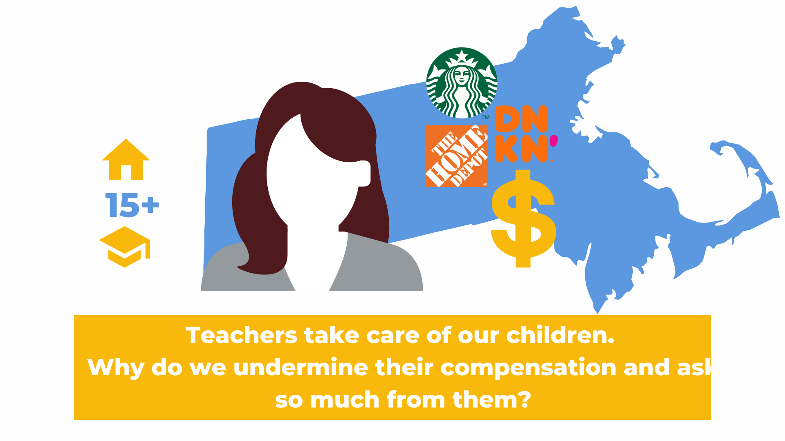

<!--
Comments in HTML are like this! 
-->




# Early Childhood Education and Care
## A Public Good with Comparable Compensation


### Current System

*“Educators are really subsidizing the system with their low wages...An expensive, scarce, underpaid child care system has been able to endure in part because of the long-term devaluing of care work, specifically as performed by women and especially women of color.” Center for the Study of Child Care Employment, Berkeley"*


## Social and Economic Issues


## Social Justice and Equity

*“If we want to address racial equity as a society, we have to address equitable compensation and support for the [early childhood] workforce.” John B. King, Former US Secretary of Education*

The profession of early childhood is 97% women and a majority of those are women of color;
More women than men have left the workforce because of child care issues; 
Family Child Care programs are primarily women-owned businesses; 
Child care deserts are found in areas defined by race, income, and geography;
“Areas with enough child care tend to be...higher educated communities, whether it’s in urban metros or suburban enclaves.” Washington Post, June 22, 2020.
Extraordinary disparity with public school salaries
Public School salary schedules do not differentiate between preschool teachers and high school teachers within the district.

*“The fact that public preschool teachers get paid twice as much as preschool teachers in community preschools is criminal.” Early Ed Compensation Survey respondent 2021*


## Economic Sustainability

“...the consequences of inaction are clear: either we increase compensation for the early childhood workforce, or we will be left with no workforce at all.” NAEYC, Compensation Matters Most, June 2021

Recruitment and retention of the workforce is a significant concern.
The majority of the workforce is considering, or has left the field, due to compensation.
Governor Baker in the Future of Work Report anticipates the state will need an additional 30,000 child care educators by 2030.
Many programs are facing teacher shortages and therefore reduced enrollment capacity.
Qualified educators leave community programs to teach in public schools because of compensation.
The majority of survey respondents indicate they have considered leaving or have left early education positions due to compensation.


*“My income as a preschool teacher barely covered our bills. I was able to move into a public school system and feel far more able to care for my family.” Early Ed Compensation Survey respondent 2021*


## Child Development

*“...child development-particularly from birth to five years-is a foundation for a prosperous and sustainable society.” Center on the Developing Child at Harvard University*

Science and research support the value of high quality early education experiences.
Quality correlates with compensation.
Positive outcomes affect individuals, families, and communities.

*“Early Childhood compensation relates to the quality of the programming. It does not attract or retain the talent we need to create top programs.” Early Ed Compensation Survey respondent 2021*


## Barriers to Equitable Compensation

# Tuition-based Revenue Source

*“Being an educator for over 25 years has shown me that the tug of war between salaries and tuition has not changed and the underlying pressure and conflict between educators and parents continue to rise.” Early Ed Compensation Survey respondent 2021*

Massachusetts families spend 39% of their income on tuition. Future of Work Report 2021
Center-based programs allocate 70 - 100% of their budgets to compensation.
The majority of funding for both center-based and family child care is private funding.

*“Right now 100% goes to payroll. We are slowly dwindling our accounts to pay for bills, supplies, and employee benefits...We have only survived because of the 2 PPP loans, a grant from EEC.” Personal email, July 12, 2021*


## Market Comparisons

Perpetuate the bias and long standing discrimination against women and women of color. 
Do not reflect the true cost of child care
“...many women continue to earn significantly lower than men for equal work...In many instances, the pay disparities can only be due to continued intentional discrimination or the lingering effects of past discrimination.” Rizo v. Yovino, 2019 California case on market comparisons. 
Solution: Definition of Comparable Work
In 2018 Massachusetts Act to Establish Pay Equity defined “comparable work” as broader and more inclusive than the Equal Pay act, and defines comparable work as “work that requires substantially similar skill, effort, and responsibility, and is performed under similar working conditions.” “Substantially similar means that each of the factors being considered ([skill, effort and responsibility]) are alike to a great or significant extent, but are not necessarily identical or alike in all respects. Minor differences in skill, effort, or responsibility will not prevent two jobs from being considered comparable.”

The skill, effort, and responsibilities of early childhood educators are comparable to those of educators in the public school system who teach preschool through high school. Public School compensation systems do not differentiate between educators based on the age of the student they teach. The extraordinary difference in the compensation of community early childhood educators and public school educators is unjustifiable. If the early childhood workforce is 97% female, I propose that the disparity in compensation reflects a longstanding gender bias.

*“Let’s face it...there’s still serious disparities in pay based on race and gender.” Angela Cornell, director of the Labor Law Clinic, Cornell Law School*


## The Workforce

The early childhood educators in Massachusetts holding positions with the title of “lead teacher” in center-based programs are experienced and educated; 76.2% of these lead teachers hold at least a bachelor’s degree and qualify for comparable compensation per Massachusetts own definition. They are also highly experienced, as seen in the chart below.


How Far Are We From Comparable Compensation?
Current Public School and Early Childhood Compensation
Public School compensation and benefits vary among districts, however they all include increases in compensation based on education and experience. 


```{r, include=FALSE, warning = FALSE}
# image of compensation of pre-school and high school teachers 


```


In contrast, compensation of early educators varies very little across the state, 40% report they do not receive an annual increase, and 60% report they do not receive an increase based on additional education. In fact, the compensation for lead, center-based teachers holding a bachelor’s degree is similar to those with a high school diploma.


```{r, include=FALSE, warning = FALSE}
# plot of salary range by degree 


```


## Public Funding for Comparable Compensation


*“So it comes down to this: Any child care plan that does not start with hugely, massively, tremendously increasing child care teacher wages and benefits is not a credible plan….Child care shouldn’t be a low-wage industry to begin with, given the indelible impacts on child development, family stability, and the overall economy...The fact is there is no high-quality child care system without a sustainable workforce.
So as policymakers turn their attention from salvaging the existing child care system to building one that works, the first-order question must be: How do we get enough public money flowing annually into the sector to allow wages to rapidly rise?” Eliott Haspel, March 16, 2021*

