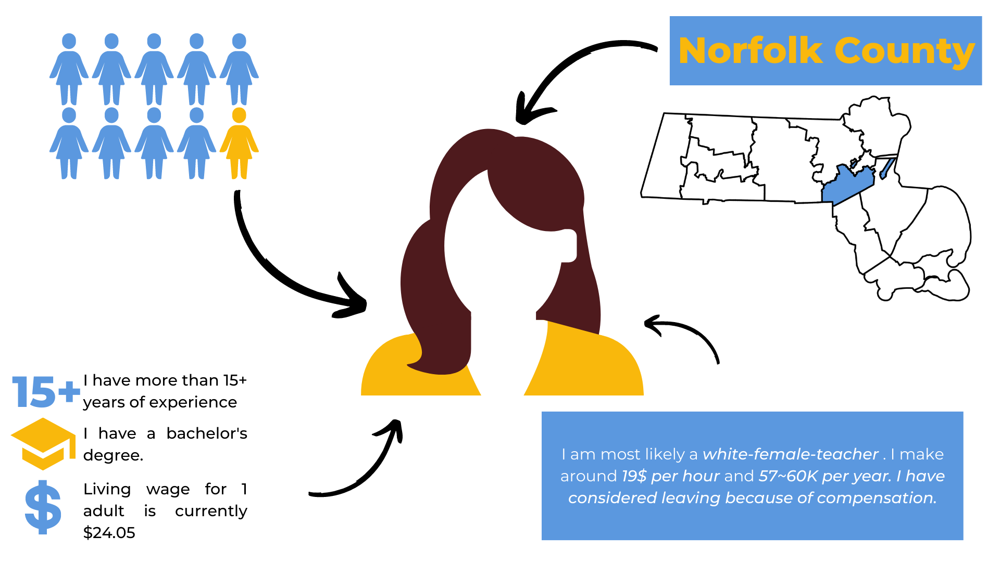
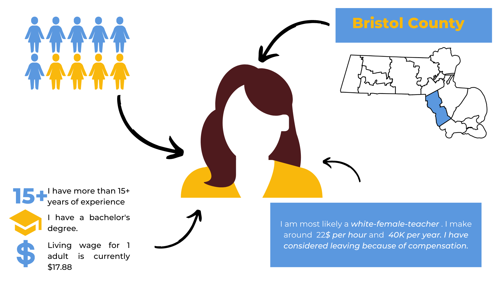
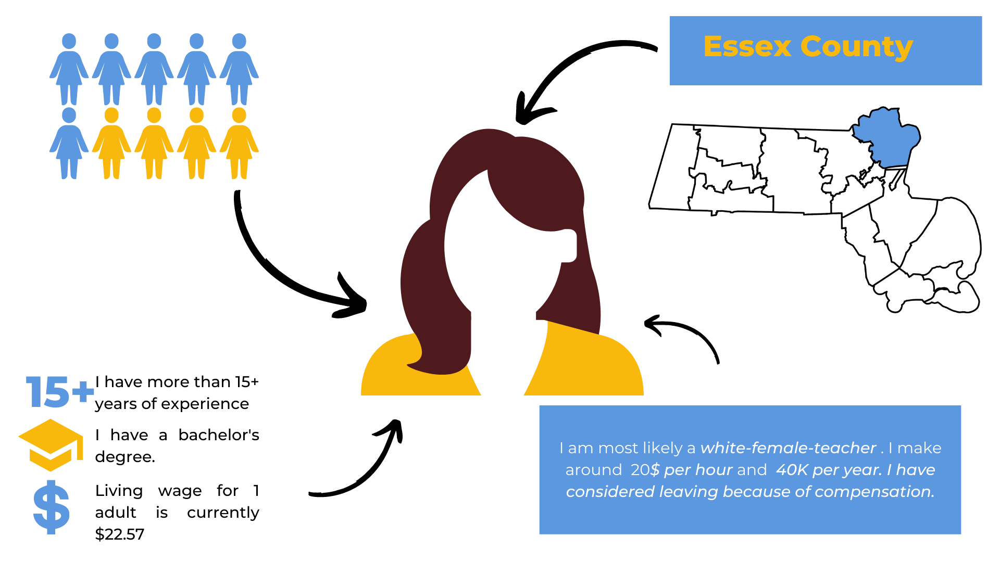
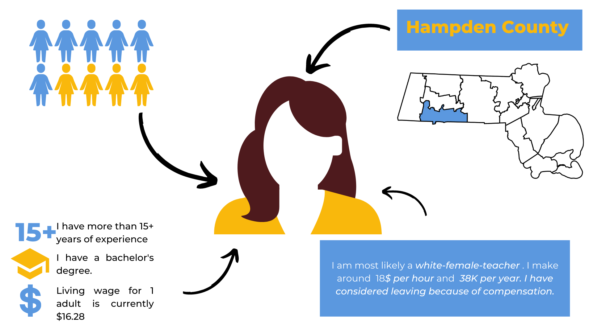
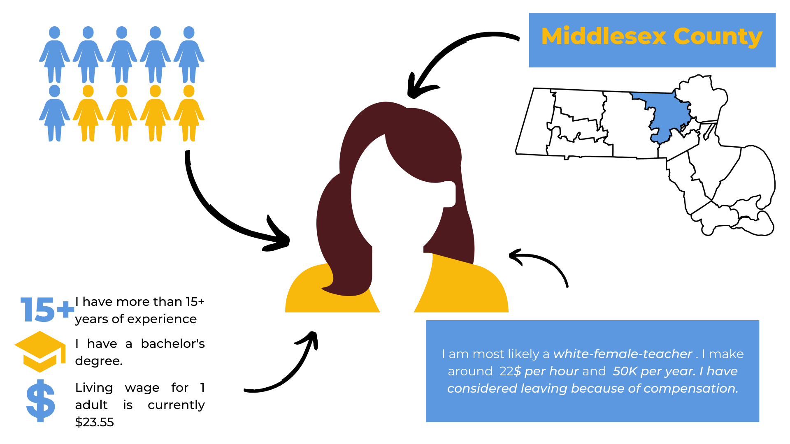
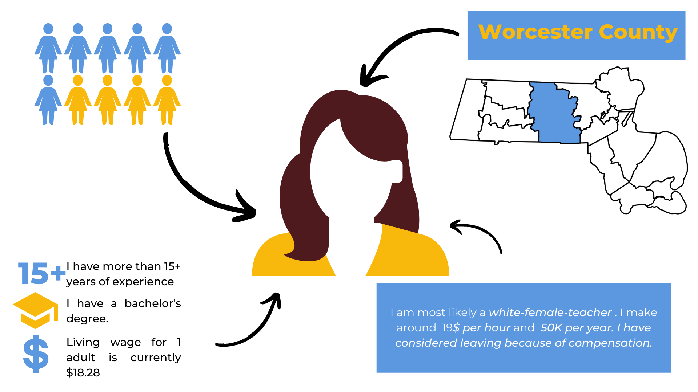

<!--
Comments in HTML are like this! 
-->


```{r, message=FALSE, warning=FALSE, echo=FALSE}
# Do not edit this chunk unless you know what you are doing
knitr::opts_chunk$set(
  echo = TRUE, message = FALSE, warning = FALSE, fig.width = 16/2, fig.height = 9/2
)
# Load all packages here
library(tidyverse)

```


## Norfolk County 




## Hampshire County 


## Barnstable County 

 

## Berkshire County 


## Bristol County 



## Essex County 



## Franklin County 


## Hampden County 



## Middlesex County 



## Suffolk County 


## Worcester County 




