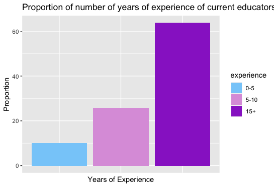
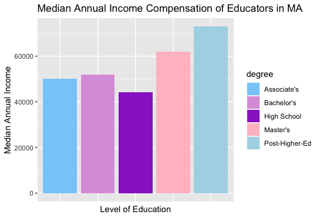
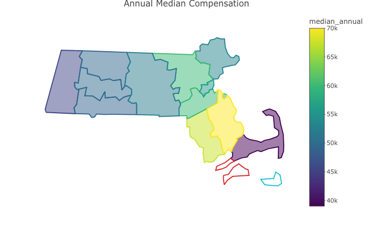
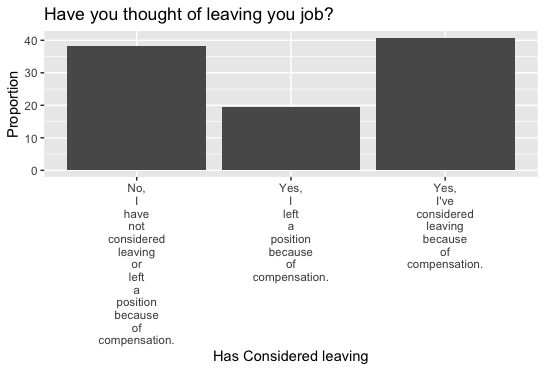
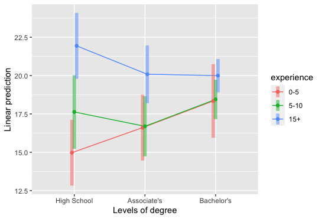

<!--
Comments in HTML are like this! 
-->

## Overall Demographics 

### Level of Education

Currently, around 63.3% of educators who filled out the survey and are actively working as teachers in both private and public elementary and center-based programs do hold a Bachelor's degree. On average, college tuition in a state/public school in Massachusetts costs around  
 13,729 dollars and for private institutions 47,980 dollars. Besides that, experience is an important requirement when it comes to hiring educators. However, there is no positive correlation as to whether an early childhood educator will have an increasing compensation the more years and education they have. 

### Median Annual Income

As seen in the Educator Profiles section, most educators do not earn the minimum wage to live properly across different counties. It is also important to highlight that these wages are for one adult only, while most educators do have a family or in the case of women, are single-mothers. 

There is an importance of early chilhood education that is not being acknowledged. The first three years of childhood development is essential to the future of a child. We need people that are not only prepared at an educational level but also people who do love this job and have a passion towards it. 

Yet, what happens when compensation is not enough to reach personal and family goals? 
Teachers leave. 

This can bring terrible consequences, creating a huge gap in filling out different children's needs as well as reducing the number of placements in each center. 

### Have you thought of leaving your job due to compensation?

It has been known since the early ages, that teaching was a non-respected job and therefore it seems like our society has for granted that teachers are underpaid and will be. 
Teachers have found themselves leaving the classrooms to find jobs categorized as "blue collar" jobs since these have less expectations of their employees and offer even better benefits and pay ranges. 

## Anova (Analysis of Variance)

Statistical Analysis:

One of the highlights of the current issues faced by educators are the low compensation given to educators with high levels of education as well as years of experience. 
A two-way anova was performed to see if there were any relationships between annual salary rate when interacting with  level of education and years of experience. 

Hypothesis: 
$$
\begin{align}
&H_0 = \text{There is an interaction effect between annual salary rate and years of experience.}\\
&H_1 = \text{There is not an interaction effect between annual salary rate and level of education.}\\
&H_0 = \text{There is an interaction effect between annual salary rate and years of experience.} \\
&H_2 = \text{There is not an interaction effect between annual salary rate and years of level of education.}
\end{align}
$$

